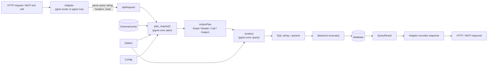

# 01 — Overview: Goals, Principles, Request Lifecycle

This document explains *why* pgvis is shaped the way it is and traces a single
request from the wire to SQL. Subsystem detail lives in the later documents; this
is the map.

## Goals

1. **PostgREST fidelity.** The query-string DSL (`select`, filter operators,
   `order`, `and`/`or`, resource embedding), the `Prefer` header semantics, and
   the `PGRST*` error codes match PostgREST so existing clients and tooling work
   unchanged. PostgREST is treated as the behavioural specification.
2. **One engine, many databases.** Postgres first, SQLite second, room for more.
   Database differences are captured as data (a `Dialect` struct), not as
   conditional compilation or forked code paths.
3. **One engine, many surfaces.** REST, OpenAPI, and MCP are thin adapters over
   a shared core. Adding a surface must not require touching the planner or SQL
   builder.
4. **Embeddable.** A host Rust application can mount the API in its own axum
   server with a few lines; the standalone binary is just one consumer.
5. **Predictable performance.** One SQL round-trip per request. Embedding and
   aggregation happen inside the database via JSON aggregation, not by
   re-assembling rows in Rust.

## Cross-cutting principles

- **Pure core.** [pgvis-core](../crates/pgvis-core) has zero runtime I/O
  dependencies — no database driver, no HTTP framework, no filesystem. This is
  enforced by its dependency set and stated in
  [lib.rs](../crates/pgvis-core/src/lib.rs). Consequence: the parser, planner,
  and SQL builder are unit-testable without a database.
- **Resolve early, render late.** The plan layer does *all* schema lookups and
  capability checks and produces a fully-resolved `ActionPlan`. The SQL builder
  never consults the `SchemaCache` or re-checks dialect capability — it
  pattern-matches a resolved tree into a string. See
  [02-core-pipeline.md](02-core-pipeline.md).
- **Deterministic SQL.** The same `ActionPlan` + `Dialect` always produces
  byte-identical SQL, which makes the builder snapshot-testable
  ([query/mod.rs](../crates/pgvis-core/src/query/mod.rs)).
- **Single result shape.** Every generated statement (read, mutate, call) is
  wrapped in a CTE that yields one row with `body`, `page_total`, and
  (Postgres) GUC-readback columns, so the driver decodes one uniform shape
  ([query/cte.rs](../crates/pgvis-core/src/query/cte.rs)).
- **One request type.** REST handlers and MCP tool handlers both build the same
  [`ApiRequest`](../crates/pgvis-core/src/plan/types.rs) and call the same
  `plan_request`. New surfaces reuse the entire pipeline.
- **No `unsafe`.** The workspace sets `unsafe_code = "forbid"`
  ([Cargo.toml](../Cargo.toml)) with clippy pedantic on.

## The pipeline

### Lifecycle of a GET, step by step

Trace of `GET /api/public/users?select=id,name&age=gte.18&order=id.asc`:

1. **Route match.** `pgvis-router` registers wildcard routes from
   `RoutingConfig`. With `schema_in_path = true` and prefix `api`, the path
   `/api/{schema}/{target}` matches; `schema = "public"`, `target = "users"`
   ([routing.rs](../crates/pgvis-router/src/routing.rs)).
2. **Build `ApiRequest`.** `build_api_request` parses query params and headers:
   `select=` via `query_params::parse_select`, `age=gte.18` via
   `query_params::parse_filter`, `order=` via `query_params::parse_order`, the
   `Prefer` header via `Preferences::parse`. The result is an adapter-agnostic
   [`ApiRequest`](../crates/pgvis-core/src/plan/types.rs).
3. **Plan.** `plan_request` validates dialect support, routes on the method
   (`Get` → `plan_read`), resolves the table and every select/filter/order item
   against a `SchemaCache` snapshot, applies the server-side `max_rows` cap, and
   returns `ActionPlan::Read(ReadPlan { … })`
   ([plan/planner.rs](../crates/pgvis-core/src/plan/planner.rs)).
4. **Render SQL.** `query::render` walks the `ReadPlan` into an inner SELECT,
   then `wrap_cte` wraps it so the result is a single row with `body` /
   `page_total` (+ GUC columns on Postgres). Parameters are pushed positionally
   (`$1` Postgres, `?` SQLite) ([query/mod.rs](../crates/pgvis-core/src/query/mod.rs)).
5. **Execute.** `Backend::execute` runs the statement on a pooled connection
   ([pgvis-postgres/src/lib.rs](../crates/pgvis-postgres/src/lib.rs) →
   [execute.rs](../crates/pgvis-postgres/src/execute.rs)). For Postgres this is
   implemented: it opens a transaction, applies `ExecContext` (`SET LOCAL role`
   / `request.jwt.claims` / `statement_timeout` / pre-request), binds parameters
   via the text protocol, runs the CTE-wrapped statement, and decodes the single
   result row into `QueryResult`. *The MCP surface still returns a plan summary
   because no backend is wired into its server — see
   [08-future-scope.md](08-future-scope.md).*
6. **Respond.** The adapter maps `QueryResult` (or an `Error` via its
   `http_status()` / `PGRST*` code) to an HTTP response or an MCP tool result.

### The MCP path

`pgvis-mcp` performs steps 1–2 differently and steps 3–6 identically. A tool
name like `public/list_users` is parsed into `(schema, verb, target)`; the verb
maps to a `RequestMethod` (`list`→GET, `create`→POST, `update`→PATCH,
`delete`→DELETE, `call`→POST RPC); tool arguments become the same `ApiRequest`.
From `plan_request` onward the two surfaces are the same code
([pgvis-mcp/src/tools.rs](../crates/pgvis-mcp/src/tools.rs)). This symmetry is
the point of the one-request-type principle — see
[04-surfaces.md](04-surfaces.md).

## Where to go next

- The parse → plan → SQL engine in depth: [02-core-pipeline.md](02-core-pipeline.md)
- The `Backend`/`Dialect` boundary and multi-DB story: [03-backends-and-dialects.md](03-backends-and-dialects.md)
- How REST/OpenAPI/MCP are generated from one cache: [04-surfaces.md](04-surfaces.md)
- The rationale behind each major choice: [07-design-decisions.md](07-design-decisions.md)
