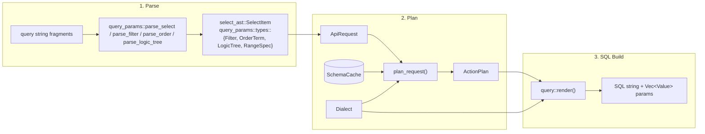
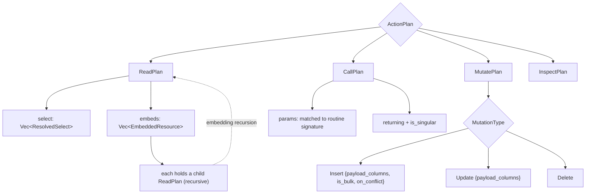

# 02 — Core Pipeline: Parse → Plan → SQL

**Status: `[Implemented]`** (with named TODO seams called out inline).

The core pipeline is the heart of pgvis and lives entirely in the I/O-free
[pgvis-core](../crates/pgvis-core) crate. It has three stages:



The strict ordering matters: **the parser knows nothing about the schema, the
planner does every lookup and capability check, and the SQL builder does
neither** — it only formats a fully-resolved tree. This is the "resolve early,
render late" principle.

## Stage 1 — Parsing the query DSL

Module: [query_params](../crates/pgvis-core/src/query_params/mod.rs). Parsers are
built with the `winnow` combinator library (see
[Cargo.toml](../Cargo.toml) and [07-design-decisions.md](07-design-decisions.md)
for why winnow over nom/pest).

| Sub-parser | File | Produces |
| ------------ | ------ | ---------- |
| `parse_select` | [select.rs](../crates/pgvis-core/src/query_params/select.rs) | `Vec<SelectItem>` |
| `parse_filter` | [filter.rs](../crates/pgvis-core/src/query_params/filter.rs) | `Filter` (operator + typed value) |
| `parse_order` | [order.rs](../crates/pgvis-core/src/query_params/order.rs) | `Vec<OrderItem>` (terms + relation terms) |
| `parse_logic_tree` | [logic.rs](../crates/pgvis-core/src/query_params/logic.rs) | `LogicTree` (`and=`/`or=` nesting) |
| shared field/JSON-path/operator parsers | [common.rs](../crates/pgvis-core/src/query_params/common.rs) | — |

The `select` AST is defined in
[select_ast.rs](../crates/pgvis-core/src/select_ast.rs). `SelectItem` has four
variants that drive different SQL: `Field` (column, with optional JSON path,
`::cast`, aggregate, and post-aggregate cast), `Relation` (an embedded resource
that becomes a JSON-aggregated subquery, with an optional `!hint` and
`!inner`/`!left` join type), `Spread` (a to-one relation whose columns are
flattened into the parent), and `Star`. The informal grammar is documented at
the top of that file.

Filter, ordering, logic, and range types live in
[query_params/types.rs](../crates/pgvis-core/src/query_params/types.rs)
(`Filter`, `FilterValue`, `Operator`, `Quantifier`, `OrderTerm`,
`OrderDirection`, `NullsOrder`, `LogicTree`, `RangeSpec`). These types are
backend-agnostic and feed every surface identically.

Parser output is *syntactic only* — `users` in `select=users(*)` is just a name;
nothing yet knows whether it is a column, a table, or a relationship.

## Stage 2 — The plan layer

Module: [plan](../crates/pgvis-core/src/plan/mod.rs). Entry point:

```rust
pub fn plan_request(
    request: &ApiRequest,
    cache: &SchemaCache,
    dialect: &Dialect,
    config: &Config,
) -> Result<ActionPlan, Error>
```

([plan/planner.rs](../crates/pgvis-core/src/plan/planner.rs))

### Input: `ApiRequest`

[`ApiRequest`](../crates/pgvis-core/src/plan/types.rs) is the adapter-agnostic
request: resolved `schema` and `target`, a `RequestMethod`, an `is_rpc` flag,
the parsed `select`/`filters`/`order`/`range`/`logic_filters`, parsed
`Preferences`, and an optional `RequestBody` (`Single` / `Bulk` / `Raw`). Both
`pgvis-router` and `pgvis-mcp` construct this — nothing below this line knows
which surface it came from.

### What the planner does

`plan_request` first calls `validate::validate_dialect_support`, then dispatches
on the method:

- `Get` / `Head` → `plan_read` → `ActionPlan::Read(ReadPlan)`
- `Post` non-RPC, `Patch` / `Put` / `Delete` → `plan_mutate` → `ActionPlan::Mutate(MutatePlan)`
- `Post` with `is_rpc` → `plan_call` → `ActionPlan::Call(CallPlan)`
- metadata endpoints → `ActionPlan::Inspect(InspectPlan)` (no SQL)

Each path resolves names against the `SchemaCache` and produces fully-resolved
nodes ([plan/resolve.rs](../crates/pgvis-core/src/plan/resolve.rs),
[plan/validate.rs](../crates/pgvis-core/src/plan/validate.rs)):

- **Tables/columns** are resolved to `ResolvedSelect` / `ResolvedColumn` with
  the column's data type and nullability copied in, so the SQL builder needs no
  cache.
- **Embedded resources** become `EmbeddedResource` carrying a `ResolvedJoin`
  (`Direct` FK, `Junction` M2M, or `Computed` function-based) and a recursive
  child `ReadPlan` — embedding is the recursion point of the whole pipeline.
- **Filters** become `ResolvedFilter` with an optional `FilterRewrite` hint
  (e.g. `ILikeViaLower`, `JsonArrayContains`, `GlobPattern`) pre-computed *here*
  so the SQL builder never branches on dialect capability.
- **Range** is capped by `PlanConfig.max_rows` (derived from `Config`) so a
  client cannot exceed the server limit.
- **Aggregates** are validated against `Config::aggregates_enabled` and
  collected for GROUP-BY synthesis.

`ResolvedTableInfo` is a *snapshot* of the relevant table metadata copied into
the plan, deliberately avoiding a borrow of the `SchemaCache` so a resolved
`ActionPlan` is self-contained and `'static`-friendly.

### Output: `ActionPlan`



All `ActionPlan` types are defined in
[plan/types.rs](../crates/pgvis-core/src/plan/types.rs). Key points:

- `ReadPlan` and `MutatePlan` both carry `embeds`, so `RETURNING` from a mutation
  can itself embed related resources.
- `MutatePlan.mutation` is a `MutationType` enum; upsert is modelled as
  `Insert { on_conflict: Some(ResolvedConflict { columns, resolution }) }`.
- `CallPlan` resolves parameters against the routine signature
  (`resolve_call_params`) and sets `is_singular` from whether the routine
  returns a set. **TODO seam:** overload resolution currently takes the first
  matching routine (`plan_call` in
  [plan/planner.rs](../crates/pgvis-core/src/plan/planner.rs)) — a scoring
  algorithm is future work; see [08-future-scope.md](08-future-scope.md).

## Stage 3 — The SQL builder

Module: [query](../crates/pgvis-core/src/query/mod.rs). The single public
function is:

```rust
pub fn render(plan: &ActionPlan, dialect: &Dialect)
    -> Result<(String, Vec<Value>), Error>
```

### `RenderContext`

`render` creates a `RenderContext`
([query/mod.rs](../crates/pgvis-core/src/query/mod.rs)) that owns the SQL buffer,
the positional parameter vector, a placeholder counter, and a subquery-alias
counter. The few dialect-aware helpers are the *only* places SQL syntax varies:

- `push_param(value)` — appends a param, returns `$N` (Postgres) or `?` (SQLite)
- `quote_ident(name)` — wraps in the dialect's quote character
- `qualified_table(schema, name)` — emits `"schema"."table"` only when
  `dialect.schema_namespacing` is true (SQLite drops the schema)
- `next_alias(prefix)` — unique subquery aliases

### Rendering by plan type

`render` matches the `ActionPlan` and delegates, then wraps the inner SQL:

| Plan | Inner renderer | File |
| ------ | ---------------- | ------ |
| `Read` | `read::render_read` | [query/read.rs](../crates/pgvis-core/src/query/read.rs) |
| `Mutate` | `mutate::render_mutate` | [query/mutate.rs](../crates/pgvis-core/src/query/mutate.rs) |
| `Call` | `call::render_call` | [query/call.rs](../crates/pgvis-core/src/query/call.rs) |
| `Inspect` | — (returns `Error::Internal`; handled by the adapter, not SQL) | — |

Shared SQL fragments (select lists, WHERE from filters + logic trees, GROUP BY,
ORDER BY, LIMIT/OFFSET) are in
[query/fragment.rs](../crates/pgvis-core/src/query/fragment.rs) and consumed by
`render_read` ([query/read.rs](../crates/pgvis-core/src/query/read.rs)).
Embedded resources are emitted as correlated subqueries that JSON-aggregate the
child rows; this is the hardest part of the builder and the reason a general SQL
query-builder library is not used (see
[07-design-decisions.md](07-design-decisions.md)).

### The CTE envelope

Every inner query is wrapped by `wrap_cte`
([query/cte.rs](../crates/pgvis-core/src/query/cte.rs)) so the driver always
decodes one row of one shape:

```sql
WITH pgrst_source AS (
  <inner_sql>
)
SELECT
  COALESCE(json_agg(_pgvis_t), '[]') AS body,
  (SELECT count(*) FROM pgrst_source) AS page_total,
  -- only when count=exact:
  (SELECT count(*) FROM pgrst_source) AS total_count,
  -- Postgres only (dialect.supports_set_local):
  current_setting('response.status', true)  AS response_status,
  current_setting('response.headers', true) AS response_headers
FROM (SELECT * FROM pgrst_source) _pgvis_t
```

`json_agg` becomes `json_group_array` on SQLite (`dialect.json_array_agg`), and
the `current_setting(...)` GUC-readback columns are omitted when
`dialect.supports_set_local` is false. The decoded shape is
[`QueryResult`](../crates/pgvis-core/src/backend.rs). The exact-count strategy
here is intentionally simplified (page count reused as total) and is a refinement
item in [08-future-scope.md](08-future-scope.md).

## Why this shape

- **Testability.** Parser and planner run against fixture `SchemaCache` values
  with no database; the builder is snapshot-tested per dialect (see the unit
  tests in [query/mod.rs](../crates/pgvis-core/src/query/mod.rs) and
  [query/cte.rs](../crates/pgvis-core/src/query/cte.rs)).
- **Surface reuse.** Because the plan is the contract, REST and MCP share 100%
  of stages 2–3 ([04-surfaces.md](04-surfaces.md)).
- **Multi-DB without forks.** Capability decisions are made once in stage 2 and
  encoded as `FilterRewrite` hints + `Dialect` flags; stage 3 has no `if
  postgres` business logic ([03-backends-and-dialects.md](03-backends-and-dialects.md)).
