# 03 — Backends and Dialects

How pgvis stays database-agnostic. There are two distinct mechanisms, and the
split between them is the central design idea:

- **`Backend` trait** — the *async I/O boundary*. Connection pooling, query
  execution, schema introspection, change notifications. One trait, implemented
  per database. **Status: `[Implemented]` for Postgres**, with a TODO seam at
  the execute-result boundary.
- **`Dialect` struct** — *pure data* describing SQL syntax and capability
  differences. No I/O, no trait, no dynamic dispatch. **Status: `[Implemented]`**
  (`POSTGRES` and `SQLITE` constants both defined).

```mermaid
flowchart TD
    SQLB[query::render] -->|reads flags| DLT[Dialect struct]
    PLAN[plan layer] -->|capability gate| DLT
    ADP[adapters] -->|hold| AB["Arc&lt;dyn Backend&gt;"]
    AB --> PGB[PgBackend]
    AB -. planned .-> LITEB[SqliteBackend]
    PGB -->|dialect&#40;&#41;| POSTGRES[&amp;POSTGRES]
    LITEB -. dialect&#40;&#41; .-> SQLITE[&amp;SQLITE]
    PGB --> POOL[deadpool-postgres pool]
    POOL --> DB[(PostgreSQL)]
```



## The `Backend` trait

Defined in [pgvis-core/src/backend.rs](../crates/pgvis-core/src/backend.rs):

```rust
pub trait Backend: Send + Sync + 'static {
    fn introspect(&self, cfg: &IntrospectConfig)
        -> BoxFuture<'_, Result<SchemaCache, Error>>;

    fn execute(&self, ctx: &ExecContext, sql: &str, params: &[Value])
        -> BoxFuture<'_, Result<QueryResult, Error>>;

    fn watch_schema(&self) -> BoxFuture<'_, Option<SchemaChangeStream>> { /* None */ }

    fn dialect(&self) -> &'static Dialect;
}
```

Design choices baked into this signature (see also
[07-design-decisions.md](07-design-decisions.md)):

- **Object-safe via `BoxFuture`.** Methods return `futures::future::BoxFuture`
  rather than using `async fn`, so adapters can hold `Arc<dyn Backend>` and
  never name a concrete driver type. The one allocation per call is negligible
  next to network I/O.
- **`serde_json::Value` params.** The SQL builder emits generic JSON values; the
  driver converts them to native wire types. This keeps the builder
  driver-free.
- **One `execute`, not per-operation methods.** Because the SQL builder fully
  renders the CTE-wrapped statement, the backend just runs the string and
  decodes the uniform [`QueryResult`](../crates/pgvis-core/src/backend.rs).
- **Synchronous `dialect()`.** Returns `&'static Dialect` — cheap, no I/O,
  callable from the hot SQL path.

### Supporting types

All in [backend.rs](../crates/pgvis-core/src/backend.rs):

| Type | Role |
| ------ | ------ |
| `IntrospectConfig` | which schemas to expose + `extra_search_path` for type/function resolution |
| `ExecContext` | per-request session setup: `role`, JWT `claims`, `pre_request`, `statement_timeout`, `tx_end` |
| `QueryResult` | decoded CTE result: `body`, `total_count`, `page_total`, `response_status`, `response_headers`, `was_insert` |
| `SchemaChangeStream` | `Pin<Box<dyn Stream<Item=()> + Send>>` — push schema-reload signal |

`ExecContext` is how row-level security and PostgREST-style GUC behaviour reach
the database: on Postgres the backend opens a transaction, `SET LOCAL role`,
sets `request.jwt.claims`, optionally calls the pre-request function, then runs
the statement. On a backend without `SET LOCAL` these fields are informational.

### The Postgres implementation

[`PgBackend`](../crates/pgvis-postgres/src/lib.rs) wraps a
`deadpool-postgres::Pool` (lazy connections; created from a DSN). It:

- `introspect()` — gets a pooled client and calls
  `introspect::load_schema_cache` ([05-schema-cache.md](05-schema-cache.md)).
- `execute()` — gets a pooled client and runs the SQL. **`[In progress]` TODO
  seam:** JSON→`ToSql` parameter binding and CTE-result decoding are not yet
  implemented (the code runs the SQL with no bound params and returns an empty
  body); this is why the surfaces currently return a plan summary. Tracked in
  [08-future-scope.md](08-future-scope.md).
- `watch_schema()` — returns `None` today; `LISTEN/NOTIFY` is a TODO.
- `dialect()` — returns `&pgvis_core::dialect::POSTGRES`.

## The `Dialect` struct

Defined in [pgvis-core/src/dialect.rs](../crates/pgvis-core/src/dialect.rs). It
is a flat struct of syntax fields and boolean capability flags, *not* a trait.

Rationale: a `dyn Dialect` trait would mean a virtual call for every SQL
fragment — thousands per complex query. A flat `&'static` struct is
branch-prediction-friendly and zero-cost to pass around. Capability decisions
are made *once* in the plan layer, not re-derived per fragment.

### Syntax fields

| Field | Postgres | SQLite |
| ------- | ---------- | -------- |
| `identifier_quote` | `"` | `"` |
| `placeholder` | `Numbered` (`$1`) | `Question` (`?`) |
| `json_array_agg` | `json_agg` | `json_group_array` |
| `json_object` | `json_build_object` | `json_object` |

`Placeholder::render(n)` produces the placeholder text; `RenderContext`
([02-core-pipeline.md](02-core-pipeline.md)) calls it.

### Capability flag matrix

From the `POSTGRES` and `SQLITE` constants in
[dialect.rs](../crates/pgvis-core/src/dialect.rs):

| Flag | Postgres | SQLite | Effect when false |
| ------ | :--------: | :------: | ------------------- |
| `supports_returning` | ✓ | ✓ | no `RETURNING`; mutation return needs a re-select |
| `supports_roles` | ✓ | ✗ | `ExecContext.role` ignored (no RLS) |
| `supports_listen_notify` | ✓ | ✗ | no push schema reload; poll/watch instead |
| `supports_set_local` | ✓ | ✗ | no GUC readback; `response_status/headers` always `None` |
| `schema_namespacing` | ✓ | ✗ | table refs drop the schema qualifier |
| `has_routines` | ✓ | ✗ | no `/rpc/*` routes, no `call_*` MCP tools |
| `supports_aggregates` | ✓ | ✓ | `select=col.sum()` rejected |
| `supports_ilike` | ✓ | ✗ | rewrite `ILIKE` → `LOWER() LIKE LOWER()` |
| `supports_regex_match` | ✓ | ✗ | `match`/`imatch` rejected or rewritten |
| `supports_fts` | ✓ | ✓ | full-text search rejected (different syntax per DB) |
| `supports_array_ops` | ✓ | ✗ | `cs`/`cd`/`ov` rejected |
| `supports_range_ops` | ✓ | ✗ | range operators rejected |
| `supports_estimated_count` | ✓ | ✗ | `count=estimated` falls back to `exact` |
| `supports_quantifiers` | ✓ | ✗ | `op(any)`/`op(all)` rejected or fanned out |
| `supports_set_timezone` | ✓ | ✗ | `Prefer: timezone` ignored |
| `supports_is_distinct` | ✓ | ✗ (conservative) | `IS DISTINCT FROM` avoided |

### How dialect gating works

Two phases, never re-checked in the SQL builder:

1. **Plan-time rejection.** `validate::validate_dialect_support`
   ([plan/validate.rs](../crates/pgvis-core/src/plan/validate.rs)) returns an
   `Error::Unsupported` (HTTP 400, code `PGV001`) when a request needs a
   capability the dialect lacks — e.g. an array operator on SQLite, or an
   `/rpc/*` call when `has_routines` is false.
2. **Plan-time rewrite annotation.** When an operator is *expressible
   differently* rather than impossible, the planner attaches a `FilterRewrite`
   to the `ResolvedFilter` (e.g. `ILikeViaLower`, `JsonArrayContains`,
   `GlobPattern`, `JsonExtractFunction`, `InstrFallback`). The SQL builder reads
   the hint and emits the dialect-appropriate fragment with no capability
   logic of its own.

`FilterRewrite` is defined alongside `ResolvedFilter` in
[plan/types.rs](../crates/pgvis-core/src/plan/types.rs). It is the explicit
bridge that keeps the plan layer and SQL builder decoupled while still producing
correct multi-dialect SQL.

## SQLite backend `[Planned]`

The `SQLITE` dialect constant already exists and the SQL builder + CTE wrapper
already special-case it (see the SQLite unit tests in
[query/cte.rs](../crates/pgvis-core/src/query/cte.rs)). What is missing is a
`pgvis-sqlite` driver crate implementing `Backend`. Expected differences a
SQLite implementation must handle, all already anticipated by flags/rewrites:

- single namespace (`schema_namespacing = false`; cache uses `"main"` by
  convention — see [05-schema-cache.md](05-schema-cache.md))
- no roles / GUCs (`ExecContext` role+claims informational; no response GUCs)
- `ILIKE`/regex/array/range/quantifier rewrites or rejections per the matrix
- schema-change detection via `PRAGMA schema_version` polling or file-watching
  rather than `LISTEN/NOTIFY` (`watch_schema()` returns `None`)

## Adding a new database (e.g. MySQL/DuckDB) `[Planned]`

The architecture is designed so a new backend touches only its own crate:

1. Add a `&'static Dialect` constant (quote char, placeholder style, JSON
   function names, capability flags).
2. If an operator needs different syntax, add a `FilterRewrite` variant and emit
   it from the SQL builder's rewrite match.
3. Implement `Backend` (pool, introspection against the DB's catalog,
   execute, optional `watch_schema`).
4. No changes to the parser, plan layer, or any surface adapter.

This is examined further, with the known sharp edges (e.g. `Dialect` is not yet
`#[non_exhaustive]`, three-part names for catalog databases), in
[08-future-scope.md](08-future-scope.md).
