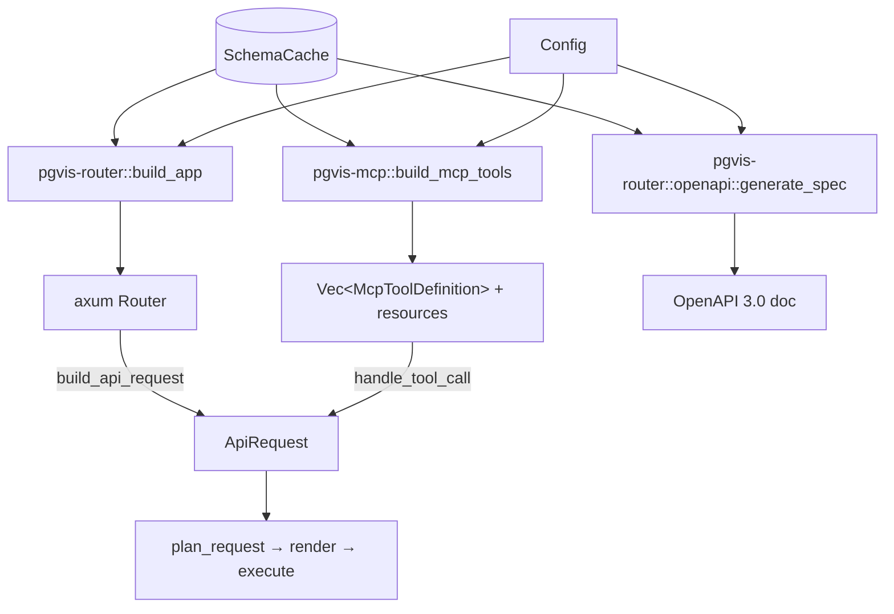

# 04 — Surfaces: REST, OpenAPI, MCP

A *surface* is a way to consume the same database engine. pgvis has three plus
two delivery wrappers. The defining property: **every surface lowers its input
into one `ApiRequest` and runs the same `plan_request` → `render` →
`Backend::execute` pipeline.** A surface is an adapter, never a fork of the
engine.

## REST `[Implemented]`

Crate [pgvis-router](../crates/pgvis-router). Entry point
`build_app(cache, config, dialect, backend) -> axum::Router`
([routing.rs](../crates/pgvis-router/src/routing.rs)).

### Routing modes

Routes come from `RoutingConfig`
([pgvis-core/src/config.rs](../crates/pgvis-core/src/config.rs)). Three modes:

| Mode | Condition | URL shape |
| ------ | ----------- | ----------- |
| Full path (default) | `schema_in_path = true` | `/{prefix}/{schema}/{table}`, `/{prefix}/{schema}/rpc/{fn}` |
| Prefix only | `schema_in_path = false`, `prefix = "api"` | `/api/{table}` — schema from `Accept-Profile` header or `default_schema` |
| PostgREST compat | `schema_in_path = false`, `prefix = ""` | `/{table}` — drop-in for existing PostgREST clients |

Rather than registering one route per table (which would force a router rebuild
on every schema reload), `build_app` registers a small set of **wildcard
routes** and resolves the concrete target at request time against the current
cache snapshot. `GET /` is the root: it returns the OpenAPI document when the
`Accept` header asks for it, otherwise a list of exposed schemas
(`handle_root`).

### State and hot reload

`AppState` ([routing.rs](../crates/pgvis-router/src/routing.rs)) holds
`Arc<ArcSwap<SchemaCache>>`, `Arc<Config>`, `Arc<Dialect>`, and
`Arc<dyn Backend>`. The
`ArcSwap<SchemaCache>` lets a schema reload atomically replace the cache without
rebuilding the router or interrupting in-flight requests; handlers call
`state.cache.load()` per request to get the latest snapshot.

### Request handling

`dispatch_request` → `build_api_request` parses HTTP into an `ApiRequest`:
`select=`/`order=` via the `query_params` parsers, column filters via
`parse_filter` for any non-reserved query key, `limit`/`offset` into a
`RangeSpec`, the `Prefer` header via `Preferences::parse`, and the JSON body
into `RequestBody::Single`/`Bulk`. It then calls `plan_request`,
`query::render`, and `Backend::execute`, and maps the resulting `QueryResult`
to an HTTP response; errors are mapped to `err.http_status()` with the `PGRST*`
code body (see [06-errors-and-config.md](06-errors-and-config.md)). This path is
exercised end-to-end by the integration suite in
[crates/pgvis-server/tests](../crates/pgvis-server/tests). **Remaining gaps**
([08-future-scope.md](08-future-scope.md)): `and=`/`or=` query parsing
(`logic_filters` is left empty), JWT claim extraction into `ExecContext`,
relation ordering, and content negotiation.

## OpenAPI `[In progress]`

Module [pgvis-router/src/openapi.rs](../crates/pgvis-router/src/openapi.rs). Entry
point `generate_spec(cache, config) -> openapiv3::OpenAPI`.

The spec is generated by **iterating the same `SchemaCache` and `RoutingConfig`
that build the routes**, so paths in the document match the routes that exist —
they cannot drift, because both are derived from one source in one pass. For
each table/view it emits a path with `GET` and (conditionally) `POST`/`PATCH`/
`DELETE` based on `Table.insertable`/`updatable`/`deletable`; RPC functions get
a path keyed by volatility. The `openapiv3` crate is used because it is a pure
data model serialized at runtime, not a compile-time derive macro framework —
pgvis builds the document from runtime introspection
([07-design-decisions.md](07-design-decisions.md)). Current state: paths,
operations, summaries, tags, and descriptions are emitted; rich request/response
JSON Schemas and per-column query parameters are not yet filled in
([08-future-scope.md](08-future-scope.md)).

## MCP `[In progress]`

Crate [pgvis-mcp](../crates/pgvis-mcp). `build_mcp_tools(cache, config)` is the
deliberate parallel of `build_app` — same inputs, different surface
([tools.rs](../crates/pgvis-mcp/src/tools.rs)).

### Tool generation

For every exposed table: a `list` tool always; `create`/`update`/`delete` tools
gated on `Table.insertable`/`updatable`/`deletable`. For every routine: a `call`
tool. Tool names come from `RoutingConfig::mcp_tool_name` —
`{schema}{separator}{verb}_{target}` (e.g. `public/list_users`), with the schema
prefix omitted only for the default schema in non-schema-in-path mode. Each
tool's `input_schema` mirrors the query DSL (`select`, `filters`, `order`,
`limit`, `offset`; `rows` for create; `values`+`filters` for update; routine
params for call).

### Resources

`build_mcp_resources` exposes discovery URIs so an agent can learn the schema
before calling tools: `pgvis://schemas`, `pgvis://{schema}/schema`, and
`pgvis://{schema}/{table}/columns`.

### Execution

`handle_tool_call` ([tools.rs](../crates/pgvis-mcp/src/tools.rs)) parses the
tool name into `(schema, verb, target)`, maps the verb to a `RequestMethod`
(`list`→`Get`, `create`→`Post`, `update`→`Patch`, `delete`→`Delete`,
`call`→`Post` with `is_rpc`), builds an `ApiRequest`, and calls the same
`plan_request`. **Unlike REST, MCP still returns a plan summary:** no backend is
constructed for `McpServer` (`pgvis-lib` builds it with cache/config/dialect
only), so `query::render` + `Backend::execute` are not yet invoked here
([tools.rs](../crates/pgvis-mcp/src/tools.rs) TODO,
[08-future-scope.md](08-future-scope.md)). Known parser gaps (select string,
order, logic) are shared with REST.

## Delivery wrappers

### `pgvis-lib` `[Implemented]`

[pgvis-lib](../crates/pgvis-lib/src/lib.rs) is a fluent `Builder` for host
Rust apps: `Builder::new(dsn).schemas([...]).build().await -> axum::Router`.
`build_components()` constructs a `PgBackend`, introspects into an
`ArcSwap<SchemaCache>`, calls `pgvis-router::build_app`, and optionally merges
the MCP Streamable-HTTP service at `/mcp` (`with_mcp_http()`); `build()` returns
just the router and `build_mcp_server()` returns a stdio `McpServer`. It is the
single authoritative way to assemble the stack — the binary uses it too.

### `pgvis-server` `[Implemented]`

[pgvis-server](../crates/pgvis-server/src/main.rs) is the `pgvis` binary. It
parses a `clap` CLI (`--dsn`, `--config`, env-var fallbacks) with subcommands
`serve` (default), `mcp`, `openapi`, and `inspect`, initializes JSON tracing,
and runs each command through `pgvis-lib`. Remaining gap: `load_config` still
returns `Config::default()` — TOML/figment file layering is stubbed
([08-future-scope.md](08-future-scope.md)).

## Why surfaces are this thin

The cost of a new surface is "translate my input into `ApiRequest`, translate
`QueryResult`/`Error` into my output." Everything else — schema resolution,
relationship disambiguation, dialect gating, SQL generation, the CTE result
contract — is shared. REST and MCP already prove the model: they diverge only in
their adapter files and converge from `plan_request` onward
([02-core-pipeline.md](02-core-pipeline.md)). A future gRPC or GraphQL surface
would follow the same recipe ([08-future-scope.md](08-future-scope.md)).
