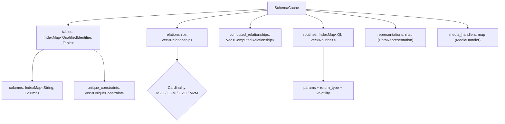

# 05 — Schema Cache and Introspection

**Status: `[Implemented]`** for the cache types and Postgres introspection, with
specific future-only sub-features tagged `[Planned]` inline.

The `SchemaCache` is the single source of truth about the database's exposed
surface. Every surface and the plan layer read from it; nothing below the
adapter layer talks to the database catalog directly.

## Lifecycle

```mermaid
flowchart LR
    START[startup or reload] --> INTRO["Backend::introspect&#40;cfg&#41;"]
    INTRO --> CAT[(database catalog)]
    CAT --> ASM[assemble SchemaCache]
    ASM --> PP[post-process:<br/>M2M + inverse rels + FK marking]
    PP --> SWAP["ArcSwap&lt;SchemaCache&gt;.store"]
    SWAP --> USE[plan layer, routes, OpenAPI, MCP tools<br/>read latest snapshot per request]
    NOTIFY[schema change signal] --> START
```

The cache is held behind `ArcSwap<SchemaCache>` in the REST `AppState`
([04-surfaces.md](04-surfaces.md)) so a reload swaps it atomically without
rebuilding routes or blocking readers.

## Cache types

Defined in [pgvis-core/src/cache.rs](../crates/pgvis-core/src/cache.rs). All
types use *string* type names (not Postgres OIDs) so they are valid for both
Postgres (`int4`, `jsonb`) and SQLite (`INTEGER`, `TEXT`).

| Type | Purpose | Notes |
| ------ | --------- | ------- |
| `QualifiedIdentifier` | `schema.name` key | SQLite uses `"main"` by convention |
| `SchemaCache` | top-level container | `IndexMap` preserves introspection order → deterministic OpenAPI |
| `Table` | table or view | `is_view`; `insertable`/`updatable`/`deletable` drive which HTTP methods/MCP tools exist |
| `Column` | one column | `typ` (resolved base), `nominal_type` (declared), `nullable`, `default`, `enum_values`, `is_generated`, `updatable`, `is_pk`, `is_fk`, `ordinal` |
| `Relationship` | FK edge | `source/target` tables+columns, `cardinality`, `constraint_name` (disambiguation), `is_self` |
| `Cardinality` | M2O / O2M / O2O / M2M | M2M carries the junction table + its source/target FK columns inline |
| `Routine` | stored function | `params`, `return_type`, `return_type_is_set/_is_composite`, `volatility`, `isolation_level`, hoisted `settings` |
| `UniqueConstraint` | unique/PK constraint | used for upsert `ON CONFLICT` targeting |
| `ComputedRelationship` | function-as-relationship | **`[Planned]` data only** — Postgres-only; populated as a TODO |
| `DataRepresentation` | domain type ↔ json/text cast | **`[Implemented]`** introspection (`query_representations`, Postgres); builder integration is TODO |
| `MediaHandler` | custom `Accept` type → aggregate fn | **`[Planned]` data only** — Postgres-only; TODO |

`SchemaCache` exposes lookup helpers used by the planner: `find_table`,
`find_relationships` (all edges touching a table — direction filtering happens in
the planner), and `find_routines` (returns *all* overloads under a name; the
planner narrows by arguments — see the overload TODO in
[02-core-pipeline.md](02-core-pipeline.md)).

`Column` and `Table` carry rich metadata specifically so the SQL builder and
OpenAPI generator never need to re-introspect: e.g. `is_generated` excludes a
column from INSERT payloads and marks it `readOnly` in OpenAPI; `pk_cols` /
`unique_constraints` drive `Location` headers and upsert targets;
`enum_values`/`max_len`/`default` become OpenAPI constraints.

## Postgres introspection

Module [pgvis-postgres/src/introspect](../crates/pgvis-postgres/src/introspect/mod.rs).
Entry point `load_schema_cache(client, cfg)`.

It runs all catalog queries inside a transaction with `SET LOCAL search_path =
''` so every name resolves fully-qualified (and `SET LOCAL` actually takes
effect on a pooled connection). The transaction is always ended
(COMMIT on success, ROLLBACK on error), reverting the `search_path`.

Query modules:

| Module | Discovers |
| -------- | ----------- |
| [tables.rs](../crates/pgvis-postgres/src/introspect/tables.rs) | tables, views, columns, PKs, unique constraints |
| [relationships.rs](../crates/pgvis-postgres/src/introspect/relationships.rs) | foreign keys |
| [routines.rs](../crates/pgvis-postgres/src/introspect/routines.rs) | functions, parameters, volatility |
| [representations.rs](../crates/pgvis-postgres/src/introspect/representations.rs) | data representation casts |
| [post_process.rs](../crates/pgvis-postgres/src/introspect/post_process.rs) | derived metadata (below) |

### Post-processing

After the raw queries, three passes run in an order that mirrors PostgREST's
(`addInverseRels $ addM2MRels`), in
[post_process.rs](../crates/pgvis-postgres/src/introspect/post_process.rs):

1. `infer_m2m_relationships` — detect junction tables (a table whose PK columns
   are a superset of its FK columns to two other tables) and synthesize `M2M`
   relationships.
2. `add_inverse_relationships` — for every discovered M2O, add the reverse O2M
   edge so embedding works in both directions.
3. `mark_fk_columns` — set `Column.is_fk` for columns participating in any FK.

`[Planned]` introspection gaps (the fields exist on the types but are populated
empty today): computed relationships (`allComputedRels`), media handlers,
`schema_version`, and view primary-key dependency tracing. These are enumerated
in [08-future-scope.md](08-future-scope.md).

## Hot reload

`Backend::watch_schema()` ([03-backends-and-dialects.md](03-backends-and-dialects.md))
is the push channel: on Postgres it is intended to be driven by `LISTEN/NOTIFY`
on a dedicated connection (currently returns `None` — TODO). The reload sequence
is: receive signal → `introspect()` → build a new `SchemaCache` →
`ArcSwap::store`. Because surfaces use wildcard routes and read the cache
snapshot per request, no routes, OpenAPI document, or MCP tool list need to be
rebuilt structurally — they reflect the new cache on the next request.
