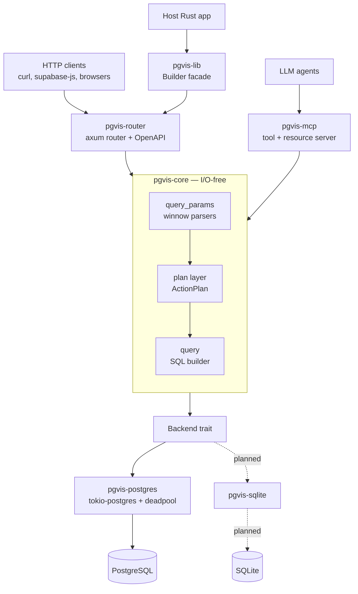
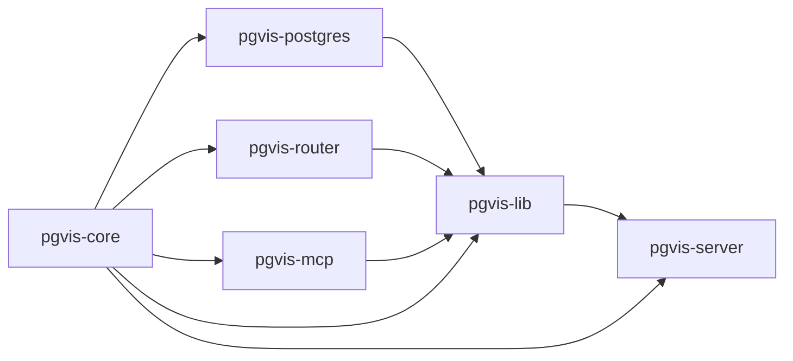

# pgvis Architecture

`pgvis` turns a relational database into a typed API surface. Point it at a
Postgres (later SQLite) database and it introspects the schema, then serves that
schema three ways from one engine: a **PostgREST-compatible REST API**, an
**OpenAPI 3.0 document**, and an **MCP (Model Context Protocol) tool server** for
LLM agents. It is a Rust workspace designed to be embedded as a library or run as
a standalone binary.

This `arch/` directory is the authoritative architecture reference for the
project. It is self-contained — every document here stands on its own and links
only to source code.

## What pgvis is, and how it differs from PostgREST

pgvis follows PostgREST's request model closely (same query DSL, same `Prefer`
semantics, same `PGRST*` error codes) so existing PostgREST clients work
unchanged. It differs in three structural ways:

- **Backend-agnostic core.** All parsing, planning, SQL building, and OpenAPI
  generation live in an I/O-free crate. Database drivers implement a single
  `Backend` trait. PostgREST hardcodes Postgres throughout.
- **Multi-surface from one pipeline.** REST and MCP both lower their input into
  one `ApiRequest`, run the same planner, and render through the same SQL
  builder. The OpenAPI document is generated from the same `SchemaCache`.
- **Schema in the URL.** Routes are `/{prefix}/{schema}/{table}` by default
  (bookmarkable, proxy-safe), with a PostgREST-compatible header/flat mode for
  drop-in replacement.

## System context

## Crate topology

Six crates. Dependencies point inward to `pgvis-core`, which has no runtime I/O
dependency (no database driver, no HTTP framework).

| Crate | Role | Key entry points |
| ------- | ------ | ------------------ |
| [pgvis-core](../crates/pgvis-core) | I/O-free engine: parser, plan layer, SQL builder, schema cache, `Backend`/`Dialect`/`Error`/`Config` | [lib.rs](../crates/pgvis-core/src/lib.rs) |
| [pgvis-postgres](../crates/pgvis-postgres) | `Backend` impl for Postgres (pool + introspection) | [lib.rs](../crates/pgvis-postgres/src/lib.rs) |
| [pgvis-router](../crates/pgvis-router) | axum router + OpenAPI generator | [routing.rs](../crates/pgvis-router/src/routing.rs) |
| [pgvis-mcp](../crates/pgvis-mcp) | MCP tools/resources from the same cache | [tools.rs](../crates/pgvis-mcp/src/tools.rs) |
| [pgvis-lib](../crates/pgvis-lib) | One-liner `Builder` facade for host apps | [lib.rs](../crates/pgvis-lib/src/lib.rs) |
| [pgvis-server](../crates/pgvis-server) | `pgvis` CLI binary (`serve`/`mcp`/`openapi`/`inspect`) | [main.rs](../crates/pgvis-server/src/main.rs) |

## Status legend

Each subsystem section in these docs carries one of:

- **`[Implemented]`** — built and unit-tested in the codebase today.
- **`[In progress]`** — scaffolded and wired, with TODO seams (typically the
  SQL-execution boundary).
- **`[Planned]`** — designed here, not yet in code.

## Status at a glance

| Subsystem | Status | Notes |
| ----------- | -------- | ------- |
| Query-string parser (`query_params`) | `[Implemented]` | winnow parsers for select/filter/order/logic |
| Plan layer (`plan`) | `[Implemented]` | `ApiRequest` → `ActionPlan`; overload resolution is a TODO |
| SQL builder (`query`) | `[Implemented]` | CTE-wrapped, dialect-aware; embedding subqueries in progress |
| Schema cache + Postgres introspection | `[Implemented]` | typed prepared-statement introspection; computed rels / media handlers / view PKs are TODO |
| `Backend` trait + `Dialect` | `[Implemented]` | Postgres impl complete — `execute()` runs the transaction and decodes the CTE row |
| Postgres query execution | `[Implemented]` | full tx pipeline (role / claims / `statement_timeout` / pre-request), text-protocol param binding, CTE result decode |
| REST routing | `[Implemented]` | routes + planning + `Backend::execute` wired; integration-tested against Postgres; JWT and `and`/`or` logic-filter parsing still TODO |
| `pgvis-server` binary | `[Implemented]` | `serve` / `mcp` / `openapi` / `inspect` wired through `pgvis-lib`; TOML config layering still stubbed (`load_config` returns defaults) |
| OpenAPI generation | `[In progress]` | paths/operations emitted; schemas/parameters minimal |
| MCP tools/resources | `[In progress]` | tools + dispatch + discovery wired, but no backend is passed to `McpServer`, so a tool call still returns a plan summary ([tools.rs](../crates/pgvis-mcp/src/tools.rs) TODO) |
| SQLite backend | `[Planned]` | `SQLITE` dialect defined; no driver crate yet |

## Table of contents

1. [Overview — goals, principles, request lifecycle](01-overview.md)
2. [Core pipeline — parse → plan → SQL](02-core-pipeline.md)
3. [Backends and dialects](03-backends-and-dialects.md)
4. [Surfaces — REST, OpenAPI, MCP](04-surfaces.md)
5. [Schema cache and introspection](05-schema-cache.md)
6. [Errors, configuration, preferences](06-errors-and-config.md)
7. [Design decisions](07-design-decisions.md)
8. [Future scope and known gaps](08-future-scope.md)
